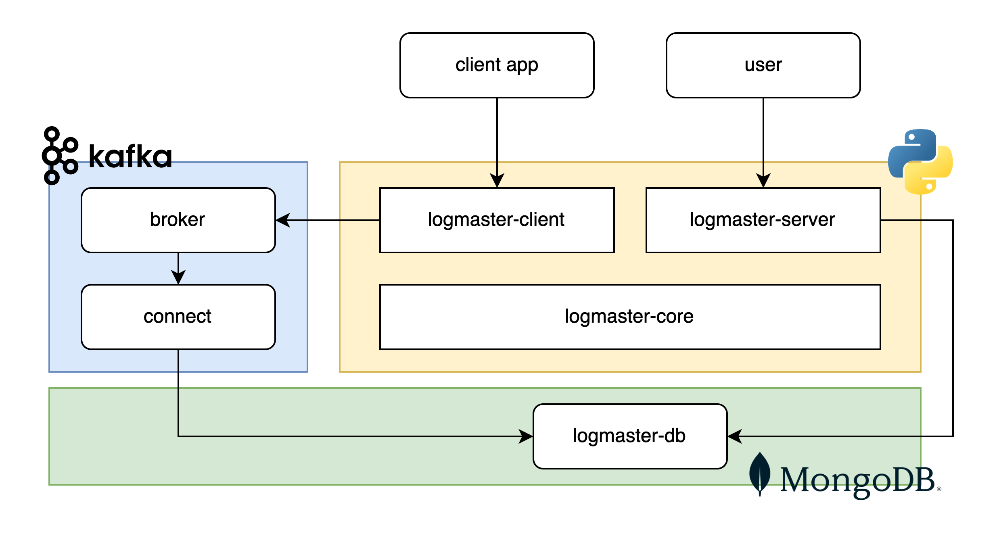

# Log-Master
A simple application used to store and query log records.

---
Main features:
* Client-side Python logger for (near) real-time ingestion of log records
* REST APIs to query log data
---

### Table of contents
* [Quickstart](#quickstart)
* [Architecture](#architecture)
  * [logmaster-core](#logmaster-core)
  * [logmaster-client](#logmaster-client)
  * [logmaster-server](#logmaster-server)
* [TODO list](#todo-list)

## Quickstart
Run the entire application stack locally:
```bash
# from the project root
docker-compose -f ./docker/docker-compose.local.yml up --force-recreate -d
```

## Architecture

* Client applications use `logmaster-client` package utilities to send messages to Kafka Broker;
* Logged messages are written to MongoDB with Kafka Connect;
* Users can query log records by interacting with REST APIs exposed by `logmaster-server`. 

### logmaster-core
The main package that contains shared utilities used by both, client and server packages. 

### logmaster-client
Provides a utility to configure the logger for a Python application and produce the related messages. Such messages are sent to Kafka and written to MongoDB using the MongoDB Sink connector. More info [here](logmaster-client/README.md).

### logmaster-server
A REST interface (FastAPI) to query log messages from MongoDB (Beanie). It also provides endpoints to manage Client Applications. More info [here](logmaster-server/README.md).

## TODO list
- Add authentication
- Add backend container to docker-compose file
- Create a notifier framework
